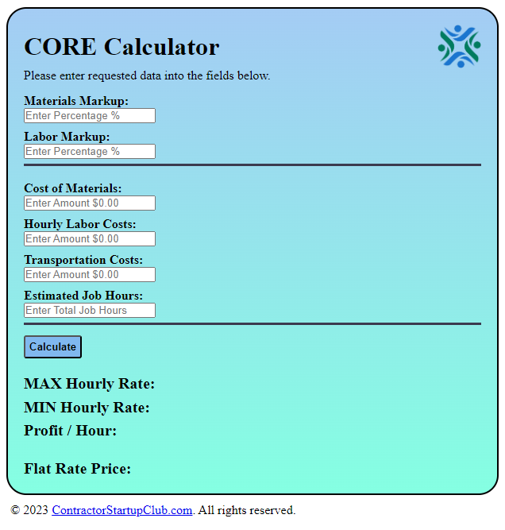

# CORE-calculator

## Description

This calculator was designed to be incorporated into the contractorstartupclub.com website where users will have the ability to calculate their maximum hourly rate, minimum hourly rate, profit per hour and the flat rate price per job. This will assist users in bidding for jobs so they can provide accurate pricing on an hourly or a flat rate basis to their clients.

This calculator allows contractors to adjust their profit margins both on materials and on labor which will allow them to meet their sales goals. It also shows them their maximum hourly rate to maximize their profit and their minimum hourly or break even point rate.

[Deployed Site](https://angi-adema.github.io/CORE-calculator/)

## Acceptance Criteria

GIVEN a contractor calculator
WHEN I load the page
THEN I am presented with the page containing the calculator fields
WHEN I enter data into all the fields
THEN I hit enter or click on the 'calculate' button
WHEN I hit enter or click on the 'calculate' button
THEN I am presented with the calculations of the MAX Hourly Rate, MIN Hourly Rate, Profit / Hour and Flat Rate Price

## Run Application

Right click on index.html in order to open in live server

## Credits

Author: Angi Adema

## Questions

GitHub: [GitHub](https://github.com/Angi-Adema)
For questions, please feel free to contact me at angi.adema@gmail.com
